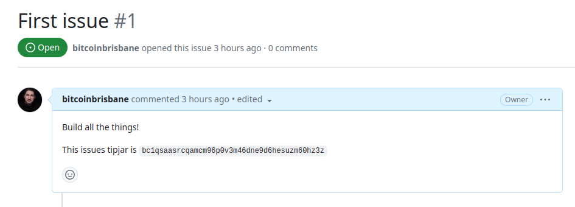

# sats-for-commits

Sats for commits allows project owners to add bitcoin bounties on their issues to pay for contributions, and let contributors claim bitcoin for their commits with their GPG key.

## Setup

- Allow GitHub issues
- Add expub key to GitHub settings

## Workflow

### Actions table

|Object | Action / Verb | Description |
|---|---|---|
|Issue | created | Adds the tip jar address to the created issue |
|Issue | funded | Adds the amount to the issues comments with tx hash.  Updates the issue label |
|Issue | closed | If the issue is no longer relevate, refund |

### Creating the issue

When a project owner creates a new issue, the issue is given a sequential integer as its id. EG `https://github.com/bitcoinbrisbane/sats-for-commits/issues/1`. This ID will for the HD address for the issue, and add the address to the issue via the PATCH route.

Path: `m/84'/0'/2164426968'/0/1`
Address: `bc1qsaasrcqamcm96p0v3m46dne9d6hesuzm60hz3z`

The following text is added to the bottom of the issue, allow with the tags "btc".   Each issue has an ID and a number.  These two numbers will create the HD address.

```json
  issue: {
    url: 'https://api.github.com/repos/bitcoinbrisbane/test-for-commits/issues/1',
    id: 2164426968,
    number: 1
    }
```

```text
This issues tipjar is bc1qsaasrcqamcm96p0v3m46dne9d6hesuzm60hz3z
```



### Fund a project

Projects can be funded globally, or per issue. Per issues can encourage contributions to specific issues, while global funding can be used to encourage contributions to the project as a whole.

Per issue gives more fine grained control, but can be more difficult to manage. Global funding is easier to manage, but can be less effective at encouraging contributions to specific issues.

### Funding the issue

A service with a webhook monitors the address for incoming transactions. When a transaction is detected, the service adds the amount to the issues comments.

If the project is funded, the amount of sats per issue can be calculated by the issue label. For example, issues with a "good first issue label" could have a bounty of 1000 sats.

### Claiming the bounty

Each GitHub user has an integer ID. This ID is used to generate a HD key for the user.

```json
  sender: {
    login: 'bitcoinbrisbane',
    id: 131337
    }
```

## Matching GPG keys to GitHub users

## Test vectors

The following mnemonic is used to generate the keys for the test vectors.

`year define slow hunt miss awake boil wrist sadness sail speak bench`

- zprvAcVNoVY3JwpXpEerADLkrqDY4jjgYpswM9SiXfBd5GR2G3XoTkp6VJFFsExewcu7o4GfwsmV3BXakWTVgs8jdxbbmSuQeWj6pbeSnQ8a4gQ
- zpub6qUjD14w9KNq2ijKGEsmDyAGcmaAxHbniNNKL3bEdbx18qrx1J8M36ZjiWVyTbhRJ5cUJWmLVhDZiJSfgQExEeaLpHosXbfWiPDoornsrmT

## GitHub permissions

- `issues` - Read/write
- `secrets` - Read
- `pull requests` - Read/write
